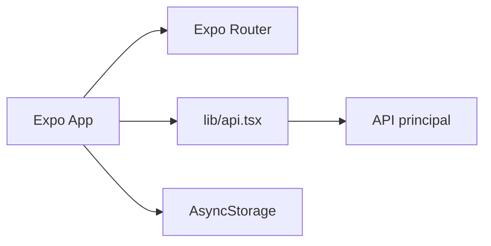
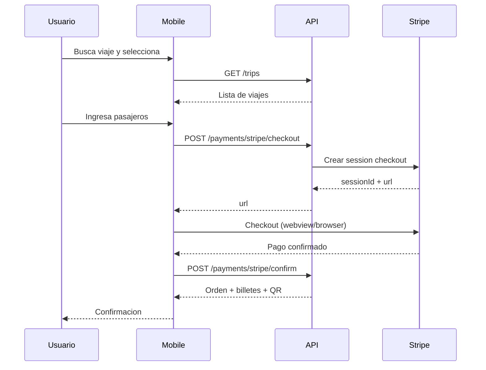

# BJourneyGo Mobile

Aplicacion movil en Expo/React Native con Expo Router. Incluye flujos de autenticacion, compra, check-in y paneles operativos.

## Stack

- Expo 54
- React Native 0.81
- Expo Router
- AsyncStorage

## Arquitectura



## Requisitos

- Node.js 18+
- npm
- Expo Go o emulador Android/iOS

## Glosario y roles

- Orden: compra que agrupa billetes.
- Billete: unidad emitida por pasajero.
- Viaje: salida programada.

Roles oficiales:

- ADMIN
- AGENCY_ADMIN
- AGENCY_WORKER
- SCANNER

## Configuracion de entorno

El API base se resuelve desde `extra.API_URL` en [app.json](app.json) o desde la variable de entorno API_URL.

Ejemplo:

- [BJourneyGo-develop/BJourneyGo-develop/.env.example](.env.example)

```env
API_URL=https://api.bjourneygo.me
```

## Instalacion

```bash
cd BJourneyGo-develop\BJourneyGo-develop
npm install
```

## Ejecutar en desarrollo

```bash
npm run start
```

Comandos utiles:

- `npm run android`
- `npm run ios`
- `npm run web`
- `npm run lint`

## Arquitectura

- Rutas y pantallas en [app](app)
- Navegacion raiz en [app/_layout.tsx](app/_layout.tsx)
- Cliente API en [lib/api.tsx](lib/api.tsx)

## Flujos clave

- Login/registro y verificacion.
- Compra de billetes y confirmacion.
- Mis viajes y cambio de viaje.
- Escaneo QR (modo scanner).

## Flujos clave (detalle)

- Autenticacion: login -> tokens -> refresh automatico.
- Compra: seleccion de viaje -> pago -> confirmacion.
- Mis viajes: listado de ordenes -> detalle -> cambio de viaje.
- Scanner: inicio de sesion -> verificacion QR -> resultado.

## Diagrama de secuencia (compra)



## Notas de API_URL

El cliente intenta resolver API_URL desde Expo extras o env, y adapta `localhost`:

- En Expo, reemplaza `localhost` por el host real del debugger.
- En Android emulator, reemplaza `localhost` por `10.0.2.2`.

## Seguridad

- Tokens en AsyncStorage.
- Refresh automatico en llamadas protegidas.

## Deep links

El esquema registrado es `bjourneygo` en [app.json](app.json).