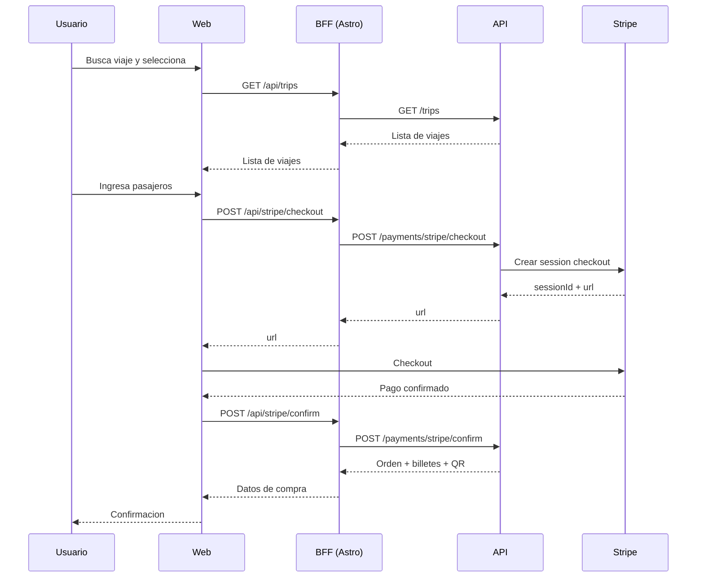

# BJourneyGo Web

Front-end web publico e intranet construido con Astro (SSR). Incluye un BFF que proxya a la API principal.

## Stack

- Astro
- Node adapter (SSR standalone)
- JavaScript/TypeScript

## Arquitectura

```mermaid
flowchart LR
	Browser[Browser] --> Astro[Astro SSR]
	Astro --> BFF[/src/pages/api]
	BFF --> API[API principal]
	Astro --> Public[public/ assets]
```

## Requisitos

- Node.js 18+
- npm

## Glosario y roles

- Orden: compra que agrupa billetes.
- Billete: unidad emitida por pasajero.
- Viaje: salida programada.
- Intranet: panel operativo.

Roles oficiales:

- ADMIN
- AGENCY_ADMIN
- AGENCY_WORKER
- SCANNER

## Configuracion de entorno

Usa el ejemplo y ajusta API_URL:

- [BJourneyGo-web/BJourneyGo-web/.env.example](.env.example)

```env
API_URL=https://api.bjourneygo.me
```

## Instalacion

```bash
cd BJourneyGo-web\BJourneyGo-web
npm install
```

## Desarrollo local

```bash
npm run dev
```

## Build y preview

```bash
npm run build
npm run preview
```

## Estructura clave

- Paginas Astro: [src/pages](src/pages)
- Endpoints BFF: [src/pages/api](src/pages/api)
- Scripts cliente: [public/src/scripts](public/src/scripts)
- Estilos: [src/styles](src/styles)

## BFF / Proxy

El BFF vive en [src/pages/api](src/pages/api) y reenvia requests a API_URL con soporte JSON, streams y form-data. Los helpers estan en [src/pages/api/_lib/proxy.js](src/pages/api/_lib/proxy.js).

## Flujos clave

- Compra web: busqueda de viajes -> pasajeros -> pago -> confirmacion.
- Mis viajes: lookup de orden y descarga de billetes/QR.
- Check-in: lookup por referencia y actualizacion de contacto.
- Intranet: panel por rol para operacion diaria.

## Flujos clave (detalle)

- Comprar: /comprar -> /comprar-pasajeros -> checkout Stripe -> /pago-exitoso.
- Mis viajes: /mis-viajes -> consulta de ordenes -> descarga PDF/QR.
- Intranet: /intranet-login -> rutas internas (agencias, operadores, escaner).

## Diagrama de secuencia (compra)



## Deploy

La configuracion SSR esta en [astro.config.mjs](astro.config.mjs). El contenedor de produccion esta en [Dockerfile](Dockerfile).

## Seguridad

- El BFF reenvia Authorization cuando existe token.
- La UI usa localStorage para flags de sesion (no sustituye controles server-side).

## Observabilidad

- Recomendado instrumentar conversion (busqueda -> checkout -> confirmacion).
- Medir errores de pagos y timeouts del proxy.

## Notas

- Hosts permitidos (Vite) se configuran en [astro.config.mjs](astro.config.mjs).
- Si la UI no carga datos, valida API_URL y el estado de la API.